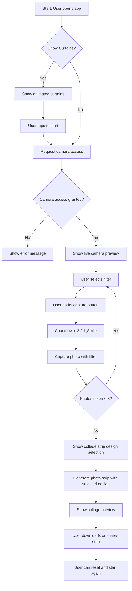

```mermaid
flowchart TD
    A[Start: User opens app] --> B{Show Curtains?}
    B -- Yes --> C[Show animated curtains]
    C --> D[User taps to start]
    D --> E[Request camera access]
    B -- No --> E
    E --> F{Camera access granted?}
    F -- No --> G[Show error message]
    F -- Yes --> H[Show live camera preview]
    H --> I[User selects filter]
    I --> J[User clicks capture button]
    J --> K[Countdown: 3,2,1,Smile]
    K --> L[Capture photo with filter]
    L --> M{Photos taken < 3?}
    M -- Yes --> I
    M -- No --> N[Show collage strip design selection]
    N --> O[Generate photo strip with selected design]
    O --> P[Show collage preview]
    P --> Q[User downloads or shares strip]
    Q --> R[User can reset and start again]
```
