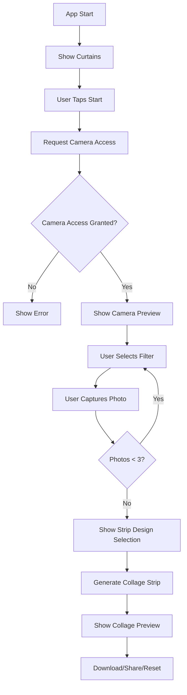

```mermaid
flowchart TD
    A[App Start] --> B[Show Curtains]
    B --> C[User Taps Start]
    C --> D[Request Camera Access]
    D --> E{Camera Access Granted?}
    E -- No --> F[Show Error]
    E -- Yes --> G[Show Camera Preview]
    G --> H[User Selects Filter]
    H --> I[User Captures Photo]
    I --> J{Photos < 3?}
    J -- Yes --> H
    J -- No --> K[Show Strip Design Selection]
    K --> L[Generate Collage Strip]
    L --> M[Show Collage Preview]
    M --> N[Download/Share/Reset]
```
